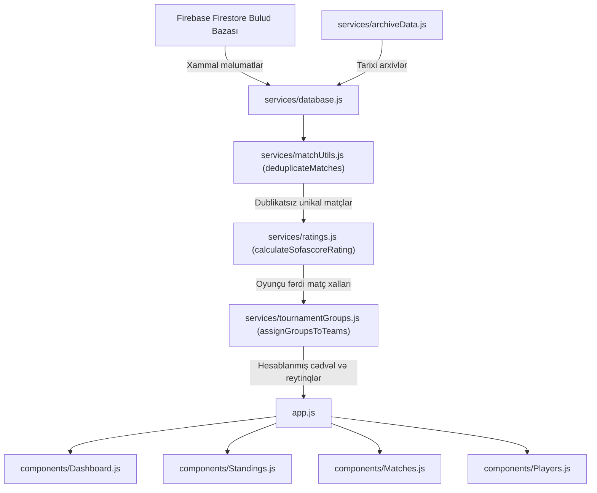

# ⚽ TDV BTL Məktəb Mini-Futbol Turniri — Kod və Arxitektura Bələdçisi

Bu sənəd layihədəki bütün faylların, xidmətlərin və komponentlərin məqsədini, cavabdeh olduğu sahələri və qarşılıqlı əlaqəsini izah edir. Layihə **təmiz modulyarlıq (Clean Modular Architecture)** və **Tək Məsuliyyət Prinsipləri (Single Responsibility Principle)** əsasında qurulmuşdur.

---

## 📁 Qovluq və Fayl Strukturu

```
school-minifootball-tournament/
├── 📄 index.html                  # Veb-tətbiqin ana HTML konteyneri və modul yükləyicisi (ESM)
├── 📄 app.js                      # Əsas tətbiq qabığı (App Shell), naviqasiya və marşrutlayıcı
├── 📄 styles.css                  # Xüsusi dizayn stilləri və kiber-idman vizual effektləri
├── 📄 STRUCTURE.md                # [BU SƏNƏD] Bütün kodların funksiya və məqsəd xəritəsi
├── 📄 vercel.json                 # Vercel yerləşdirmə və yönləndirmə konfiqurasiyası
├── 📄 parser.html                 # Köhnə arxiv məlumatlarını JSON-a çevirən daxili yardımçı
├── 📁 services/                   # Məlumat, məntiq, təhlükəsizlik və arxa plan xidmətləri
│   ├── 📄 database.js             # Əsas Baza Qatı: Firestore & LocalStorage CRUD əməliyyatları
│   ├── 📄 ratings.js              # Sofascore tipli canlı reytinq və riyazi ballar mühərriki
│   ├── 📄 matchUtils.js           # Matçların normallaşdırılması və dublikat əleyhinə filtr
│   ├── 📄 tournamentGroups.js     # Qrup püşkləri və komandaların qruplara bölünmə alqoritmi
│   ├── 📄 selfHealing.js          # Məlumat bütövlüyü auditi və avtomatik bərpa mühərriki
│   ├── 📄 security.js             # SHA-256 şifrələmə, brute-force kilidi və XSS qorunması
│   ├── 📄 geminiAssistant.js      # Gemini 3.7 Flash AI köməkçisi, çatbot və açar rotasiyası
│   ├── 📄 firebase-config.js      # Google Firebase Firestore bağlantı parametrləri
│   ├── 📄 i18n.js                 # Çoxdilli tərcümə lüğəti (Azərbaycan və İngilis)
│   └── 📄 archiveData.js          # 2017-2024 tarixi mövsümlərinin statik etalon arxivi
├── 📁 components/                 # İstifadəçi İnterfeysi (UI) Komponentləri
│   ├── 📄 Dashboard.js            # Turnir ana səhifəsi, sürətli statistikalar və liderlər
│   ├── 📄 Standings.js            # Turnir cədvəli (A/B qrupları) və pley-off (kubok) şəbəkəsi
│   ├── 📄 Matches.js              # Matçların tam siyahısı, turlar və YouTube video icmalları
│   ├── 📄 Players.js              # Oyunçular kataloqu, mövqe filtrləri və reytinq kartları
│   ├── 📄 PlayerProfileModal.js   # Oyunçunun fərdi karyera pəncərəsi və matç tarixçəsi
│   ├── 📄 GlobalSearchModal.js    # Çox-obyektli qlobal axtarış pəncərəsi (Ctrl+K)
│   ├── 📄 PublicAiChatbot.js      # Sayt ziyarətçiləri üçün interaktiv üzən AI çatbotu
│   └── 📄 AdminDashboard.js       # Turnir idarəetmə paneli (baza, redaktə, təhlükəsizlik)
└── 📁 serverless/                 # Təhlükəsizlik üçün kənar serverless proksiləri
    └── 📄 gemini-proxy-worker.js  # Cloudflare Worker API açar gizlətmə şablonu
```

---

## 🛠️ Xidmətlər (Services) — Məqsəd və Funksiyaları

### 1. `services/ratings.js` — Sofascore Reytinq Mühərriki
- **Məqsədi**: Oyunçuların canlı matçlardakı və ümumi mövsümdəki fərdi performansını 1.0 - 10.0 ballıq sistemlə qiymətləndirir.
- **Əsas Funksiyaları**:
  - `calculateSofascoreRating(stat, playerRole, matchContext)`: Qol (+0.80), assist (+0.50), vərəqələr (-0.40 / -2.00), qapıçı qurtarışları (+0.20), qapını toxunulmaz saxlama (+1.00), final bonusları və komanda qələbəsinə əsasən dəqiq matç balı çıxarır.
  - `computePlayerOverallRating(stats, initialPlayer)`: Mövsüm göstəricilərinə görə oyunçunun yekun reytinqini təyin edir.
  - `getSofascoreBadgeStyle(rating)`: Reytinq balına uyğun rəsmi Sofascore rənglərini (Göy 9+, Mavi 8+, Yaşıl 7+, Sarı 6.5+, Narıncı 6+, Qırmızı 6-) qaytarır.

---

### 2. `services/matchUtils.js` — Matç Normallaşdırma və Dublikat Filtri
- **Məqsədi**: Baza ilə yerli arxiv arasındakı hərf fərqlərini aradan qaldırır və eyni oyunun iki dəfə hesablanmasının qarşısını alır.
- **Əsas Funksiyaları**:
  - `normalizeStage(stage)`: Azərbaycan hərflərini (`ə` $\to$ `e`, `ı` $\to$ `i`) normallaşdırır (`Qrup Mərhələsi` = `qrup_merhelesi`).
  - `normalizeMatchDivision(div)`: Kateqoriyaları vahid şəklə salır (`11` $\to$ `10-11`, `7` $\to$ `7-8`).
  - `getMatchSemanticKey(m)`: Komandaların sırasından asılı olmayaraq unikal açar yaradır (`${il}_${kateqoriya}_${komandalar}_${mərhələ}_${tarix}`).
  - `deduplicateMatches(matchesList)`: Bütün matçlar massivini süzərək dublikatları 100% zəmanətlə aradan qaldırır.

---

### 3. `services/tournamentGroups.js` — Qrup Mərhələsi və Püşkatma
- **Məqsədi**: Komandaları qrup oyunlarının nəticələrinə əsasən avtomatik olaraq A, B, C və D qruplarına bölüşdürür.
- **Əsas Funksiyaları**:
  - `KNOWN_GROUP_SEEDS`: Tarixi illər üzrə təsdiqlənmiş rəsmi qruplar.
  - `assignGroupsToTeams(teamsList, matchesList, yr, div)`: Qraf alqoritmi (Connected Components) ilə bir-biri ilə oynamış komandaları eyni qrup hərfinə bağlayır.

---

### 4. `services/database.js` — Əsas Baza İdarəetmə Qatı
- **Məqsədi**: Bütün tətbiqin mərkəzi məlumat fasadıdır (Data Access Facade).
- **Əsas Funksiyaları**:
  - `getClasses()`, `addClass()`, `updateClass()`, `deleteClass()`
  - `getPlayers()`, `addPlayer()`, `updatePlayer()`, `deletePlayer()`
  - `getMatches()`, `addMatch()`, `updateMatch()`, `deleteMatch()`
  - `recalculateData()`: LocalStorage-da bütün xalları və reytinqləri sıfırdan hesablayır.
  - `recalculateInMemoryData()`: Bulud Firestore bazasından gələn xammalı yaddaşda real-vaxt cədvəlinə çevirir.
  - `getUnifiedPlayerProfile(name)`: Oyunçunun bütün illər və siniflər üzrə birləşdirilmiş karyera dosyesini çıxarır.
  - `searchAll(query)`: Oyunçular, siniflər və oyunlar üzrə ani süzgəc.

---

### 5. `services/security.js` — Kibertəhlükəsizlik və Mühafizə
- **Məqsədi**: Saytı xarici hücumlardan, XSS-dən, şifrə sındırmalarından və zərərli iframe-lərdən qoruyur.
- **Əsas Funksiyaları**:
  - `verifyAdminPassword(password)`: Duzlanmış SHA-256 heşləmə ilə şifrə yoxlanışı.
  - `checkBruteForceLockout()`: 5 səhv cəhddən sonra avtomatik 60 saniyəlik bloklama.
  - `isSessionValid()`: 2 saatlıq təhlükəsiz admin sessiyasının yoxlanması.
  - `sanitizeEmbedUrl(url)`: Yalnız etibarlı YouTube domenlərinə icazə verir.
  - `validateImportJSON(data)`: Yüklənən arxiv sənədlərinin zərərsizliyini təsdiqləyir.

---

### 6. `services/geminiAssistant.js` — Süni İntellekt (AI) Xidməti
- **Məqsədi**: Google-un ən qabaqcıl `gemini-3.7-flash` modeli ilə turnir analizini və ziyarətçi çatbotunu idarə edir.
- **Əsas Funksiyaları**:
  - `DEFAULT_GUARDIAN_POOL`: Saytın təhlili üçün 3 fərqli API açarının rotasiyası (biri tükəndikdə digərinə keçir).
  - `DEFAULT_PUBLIC_KEY`: Sayt ziyarətçiləri üçün ayrılmış müstəqil açar.
  - `askPublicChatbot()`: İctimaiyyət üçün turnir sual-cavabı.
  - `auditTournamentWithAI()`: Baza üzrə peşəkar AI audit hesabatı.

---

### 7. `services/selfHealing.js` — Özünü Bərpa və Sağlamlıq Mühərriki
- **Məqsədi**: İnsan və ya texniki səhvlər nəticəsində korlanmış məlumatları avtomatik bərpa edir.
- **Əsas Funksiyaları**:
  - `auditTournamentData()`: 0-100% arası Sistem Sağlamlıq Balı (Health Score) çıxarır, dublikatları və xətaları siyahılayır.
  - `repairTournamentData()`: Tək kliklə bütün problemləri avtomatik aradan qaldırır.
  - `startBackgroundSelfHealing()`: Sayt hər açıldıqda arxa planda gizli yoxlama aparır.

---

### 8. `services/i18n.js` — Çoxdilli Dəstək və Dinamik Kateqoriya İdarəetməsi
- **Məqsədi**: Bütün turnir interfeysinin Azərbaycan və İngilis dillərində qüsursuz işləməsini, həmçinin hər il üzrə tarixi kateqoriyaların dinamik filtrlənməsini təmin edir.
- **Əsas Funksiyaları**:
  - `t( açar, dil )`: İnterfeys mətnlərinin tərcüməsi.
  - `getDivisionLabel(div, lang)`: Yaş kateqoriyalarının rəsmi adları (məs: '9-10-cu Siniflər', '7-8-ci Siniflər').
  - `getDivisionsForYear(year)`: Seçilən mövsümdə iştirak etmiş real kateqoriyaları çıxarır (2022-dən əvvəl aşağı siniflər gizlədilir, son illərdə 7-8 və 9-10 birləşdirilir).
  - `isMatchDivision(itemDiv, targetDiv)`: Kateqoriyaların uyğunluğunu yoxlayır.
  - `getStageLabel(stage, lang)`: Matç mərhələlərini tərcümə edir.

---

## 🖥️ Komponentlər (Components) — Məqsəd və Rolları

| Fayl | Rolu və Təyinatı |
| :--- | :--- |
| **`components/Dashboard.js`** | **Turnirin Ana Səhifəsi**: Mövsüm xülasəsi, qol rekordçuları, Sofascore liderləri və son oyunlar. |
| **`components/Standings.js`** | **Turnir Cədvəli**: Qrup mərhələsi (Xal, Q, H, M, TF), pley-off (kubok) ağacı və bombardirlər. |
| **`components/Matches.js`** | **Oyunlar və Videolar**: Bütün matçların siyahısı, turlar üzrə filtr və YouTube video icmalları. |
| **`components/Players.js`** | **Oyunçu Kataloqu**: Mövqelərə görə çeşidləmə, Sofascore reytinq nişanları və oyunçu kartları. |
| **`components/PlayerProfileModal.js`** | **Fərdi Oyunçu Dosyesi**: Oyunçunun bütün tarixi mövsümlərdəki statistikası və keçirdiyi hər bir oyun. |
| **`components/GlobalSearchModal.js`** | **Qlobal Axtarış (Ctrl+K)**: Oyunçular, siniflər və oyunlar üzrə eyni anda universal axtarış. |
| **`components/PublicAiChatbot.js`** | **İctimai AI Çatbot**: Saytın sağ aşağısında üzən virtual turnir bələdçisi. |
| **`components/AdminDashboard.js`** | **İdarəetmə Mərkəzi**: Sinif, oyunçu və matç redaktəsi, Self-Healing və Təhlükəsizlik paneli. |
| **`app.js`** | **Əsas Konteyner (App Shell)**: Naviqasiya menyusu, mövsüm və kateqoriya seçici pəncərələri. |

---

## 🔄 Məlumat Axını (Data Flow)



---

## 💡 Yeni Funksiya Əlavə Etmək İstəyənlər Üçün Qaydalar

1. **Reytinq qaydalarını dəyişmək istədikdə**: Yalnız `services/ratings.js` faylında düzəliş edin.
2. **Yeni bir oyun və ya nəticə qeyd etdikdə**: `services/matchUtils.js` həmin oyunun dublikat olub-olmadığını avtomatik yoxlayacaq.
3. **Yeni bir dil və ya söz əlavə etdikdə**: Yalnız `services/i18n.js` lüğətinə daxil edin.
4. **Qrafik interfeysi dəyişmək istədikdə**: Müvafiq `components/...` faylında dəyişiklik edin, baza məntiqinə toxunmayın.
